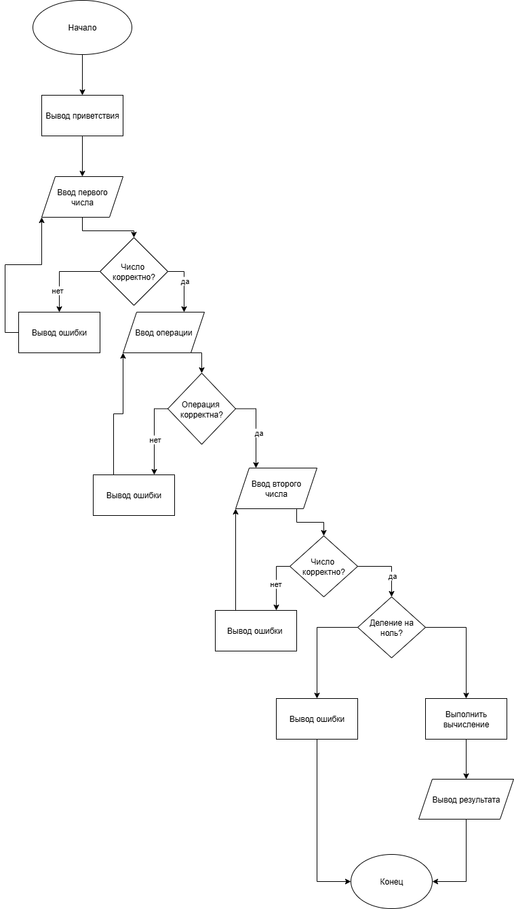

# Простой калькулятор на Python


## Описание

Это простая консольная программа-калькулятор, реализованная на Python. Она выполняет базовые арифметические операции и служит примером для изучения основ Python, управления версиями с Git и оформления проектов.

## Функциональность

Калькулятор поддерживает следующие операции:
- **Сложение** (+)
- **Вычитание** (-)
- **Умножение** (*)
- **Деление** (/)

Программа обрабатывает ошибку деления на ноль.

## Алгоритм работы

Ниже представлена блок-схема, иллюстрирующая основной алгоритм работы калькулятора:



## Требования

* **Python** версии 3.6 или выше.

## Установка и запуск

1.  Склонируйте репозиторий:
    ```bash
    git clone https://github.com/yourname/calculator.git
    ```
2.  Перейдите в папку проекта:
    ```bash
    cd calculator
    ```
3.  Запустите программу:
    ```bash
    python calculator.py
    ```

## Пример использования
Введите первое число: 10
Введите операцию (+, -, *, /): /
Введите второе число: 2
Результат: 5.0

## Структура проекта
calculator
├── calculator.py # Исходный код калькулятора
├── README.md # Документация проекта (этот файл)
└── diagram.png # Блок-схема алгоритма

## Разработка

Если вы хотите внести свой вклад в проект:
1. Сделайте форк репозитория.
2. Создайте ветку для новой функциональности (`git checkout -b feature/AmazingFeature`).
3. Зафиксируйте изменения (`git commit -m 'Add some AmazingFeature'`).
4. Отправьте изменения в ветку (`git push origin feature/AmazingFeature`).
5. Откройте Pull Request.

## Лицензия

Этот проект распространяется под лицензией MIT. См. файл `LICENSE` для получения подробной информации.

markdown
## Алгоритм работы

